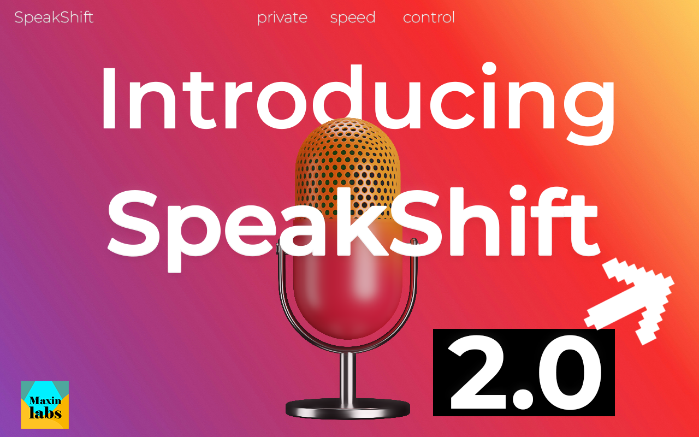
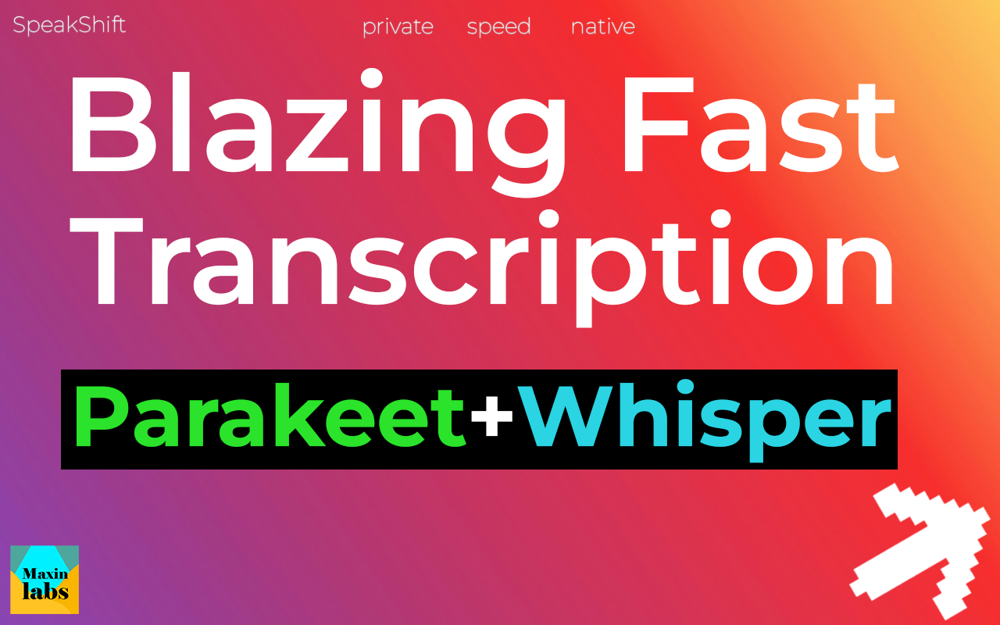
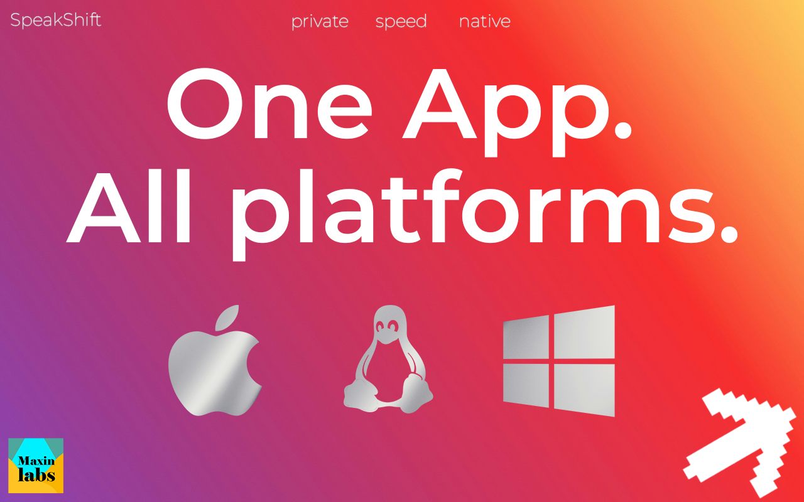

# SpeakShift

  

Fast, private, native desktop transcription and translation for creators, teams, and researchers.

  
  
  

---

## Reviews

If SpeakShift helps your work, please leave a review on Gumroad. It helps a lot.

  

Gumroad reviews: [Leave a review](https://usefulthings.gumroad.com/l/speakshift)

## Support and community

  
  

- Patreon: [Support ongoing development](https://patreon.com/MaxinLabs?utm_medium=unknown&utm_source=join_link&utm_campaign=creatorshare_creator&utm_content=copyLink)
  - Early updates and roadmap notes
  - Helps fund models, infrastructure, and feature work
- Discord: [Inquiries and support](https://discord.com/users/throttler9hit)

## Enquiries

For problems, enhancement requests, or any questions, contact: karlkuberx@gmail.com

## Content

- [Highlights](#highlights)
- [Important notes](#important-notes)
- [Features](#features)
- [Installation](#installation)
- [Usage](#usage)
  - [Batch imports](#batch-imports)
  - [Transcription](#transcription)
  - [Translation](#translation)
  - [Speaker diarization](#speaker-diarization)
- [Screens and visuals](#screens-and-visuals)
- [Support and community](#support-and-community)

---

## Highlights

- Private, on-device processing with no upload required
- Blazing fast transcription with Parakeet + Whisper
- Batch imports for folders, zips, and link queues
- Translate into 200+ languages
- Speaker diarization up to 4 speakers
- Native desktop experience across platforms

## Important notes

- SpeakShift is a desktop app; downloads are distributed via Gumroad
- For help and inquiries, use the Discord link below

## Features

- One app for Windows, macOS, and Linux
- High-speed transcription with modern models
- Batch pipelines for folders, zips, and link queues
- Multilingual translation at scale
- Speaker diarization up to 4 speakers
- Clean, native desktop experience

## Installation

1. Get the latest build from [Gumroad](https://usefulthings.gumroad.com/l/speakshift)
2. Install the app for your platform
3. Launch SpeakShift and start a new workspace

## Usage

1. Import audio or video files (or a folder/zip)
2. Choose transcription, translation, or both
3. Run the job and export results

### Batch imports

- Drop in folders or zips to create queues
- Add links to build queue-based jobs
- Reorder and run batches as needed

### Transcription

- High-speed transcription with Parakeet + Whisper
- Export to your preferred formats after processing

### Translation

- Translate into 200+ languages
- Run translation alongside transcription in one pass

### Speaker diarization

- Identify up to 4 speakers in a single job
- Use diarization to segment and label outputs

## Screens and visuals

<figure align="center">
  
  <figcaption>Introducing SpeakShift.</figcaption>
</figure>

<figure align="center">
  
  <figcaption>Batch imports for folders, zips, and link queues.</figcaption>
</figure>

<figure align="center">
  
  <figcaption>Blazing fast transcription with Parakeet + Whisper.</figcaption>
</figure>

<figure align="center">
  
  <figcaption>Translate without limits across 200+ languages.</figcaption>
</figure>

<figure align="center">
  
  <figcaption>Up to 4 speakers with diarization.</figcaption>
</figure>

<figure align="center">
  
  <figcaption>One app. All platforms.</figcaption>
</figure>

---

## Star history

